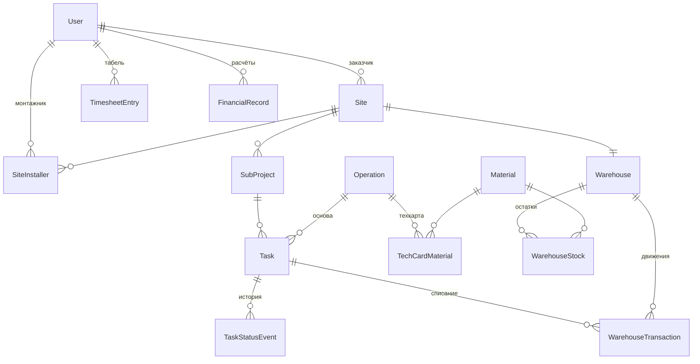

# Гильдия Комфорта — продуктовая документация

Описание системы с точки зрения пользователя: что она умеет, кто что
делает и как проходят рабочие сценарии. Техническая часть — установка,
стек, развёртывание — в [README.md](../README.md) и
[DEPLOY.md](../DEPLOY.md).

> Документация описывает **реализованную** функциональность на 4 августа
> 2026 года. Планируемых и гипотетических возможностей здесь нет: если
> чего-то нет в документах, этого нет и в приложении. Перечень осознанно
> отсутствующей функциональности — в конце
> [user-stories.md](./user-stories.md).

## Оглавление

| Документ | Что внутри |
| --- | --- |
| [**Вики одной страницей** (HTML)](./wiki.html) | Всё содержимое ниже в одном документе с боковой навигацией — открывается в браузере, удобно показывать заказчику |
| [Карта историй](./story-map.md) | Хребет из 10 активностей, полосы приоритета, сквозной путь по скелету системы, диаграмма жизненного цикла задачи |
| [User stories](./user-stories.md) | Все 42 истории с критериями приёмки и ссылками на реализующий код |
| [Сценарии использования](./use-cases.md) | 12 use cases: актор, предусловия, основной и альтернативные потоки, постусловие |

## Что это за система

«Гильдия Комфорта» — приложение для учёта монтажных работ: автоматика,
вентиляция, электрика, кондиционирование. Оно связывает три вещи, которые
обычно живут порознь — план работ, фактическое выполнение и расход
материалов.

Работы устроены иерархией: **объект** → **подпроекты** по направлениям →
**задачи**. Каждая задача основана на **операции** из справочника, а у
операции есть **технологическая карта** — какие инструменты нужны и сколько
какого материала уходит. У каждого объекта свой **склад**: материалы
приходуются администратором, а списываются автоматически в момент, когда
монтажник завершает задачу — по норме из техкарты с корректировкой по
факту. Если материала не хватает, завершить задачу нельзя.

Помимо этого система ведёт **табель** рабочего времени монтажников и
приватные **финансовые записи** — начисления и выплаты.

## Роли

| Роль | Кто это | Как появляется | Что делает |
| --- | --- | --- | --- |
| **Администратор** | руководитель работ, прораб | только сид-скриптом при развёртывании | ведёт справочники и техкарты, создаёт объекты и задачи, снабжает склад, принимает работу, ведёт расчёты |
| **Монтажник** | исполнитель на объекте | регистрируется сам на `/register` | берёт свободные задачи, ведёт их по статусам, списывает материалы, вносит часы |
| **Заказчик** | клиент, для которого идут работы | регистрируется сам на `/register` | смотрит прогресс по своим объектам — только чтение |

Зарегистрироваться администратором нельзя: в форме регистрации доступны
только роли монтажника и заказчика.

## Ключевые правила системы

Пять решений, определяющих поведение приложения. Подробности — в
[use-cases.md](./use-cases.md).

1. **Задачи не назначают — их берут.** Администратор создаёт задачу
   свободной; монтажник, назначенный на объект, забирает её сам. Обратного
   хода нет: отказаться от взятой задачи нельзя.
2. **Пауза, блокировка и возврат из проверки требуют причины.** Без
   текстового объяснения переход не выполняется. Вся история переходов
   сохраняется: откуда, куда, причина, кто и когда.
3. **Списание материалов атомарно.** Если хотя бы одного материала не
   хватает на складе, не списывается ничего, и задача остаётся в работе.
4. **Приёмка — только за администратором.** Всё до статуса «На проверке»
   делает монтажник; принять или вернуть задачу может лишь администратор.
   Статус «Выполнена» — конечный.
5. **Заказчик не видит внутреннюю кухню.** Ни монтажников, ни склада, ни
   техкарт, ни табеля, ни финансов — только состав работ и их статусы.

## Модель данных в одном взгляде

Полная схема — `prisma/schema.prisma`.

## Как читать эти документы

- **Обсуждаете охват продукта или планируете итерацию** — начните с
  [карты историй](./story-map.md): она показывает всю систему на одном
  экране и отделяет несущий каркас от остального.
- **Нужно понять, как именно работает конкретная возможность** — смотрите
  [user stories](./user-stories.md): у каждой истории есть критерии
  приёмки и ссылка на файл в коде.
- **Проверяете систему или пишете инструкцию для пользователя** — берите
  [сценарии использования](./use-cases.md): там пошаговые потоки вместе с
  тем, что происходит при ошибках.
