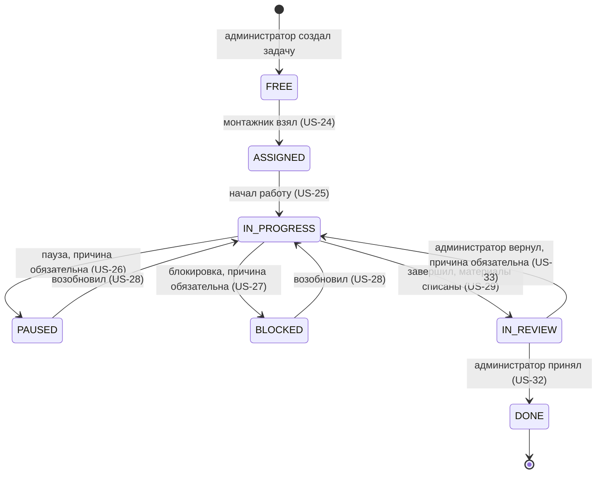

# Карта историй (User Story Map)

Карта строится по методу Джеффа Паттона: **хребет** — крупные активности
пользователя слева направо в порядке реального хода работ; под каждой
активностью — истории, разложенные по **полосам приоритета** сверху вниз.

Полное описание каждой истории с критериями приёмки — в
[user-stories.md](./user-stories.md). Визуальная версия карты доступна
отдельным HTML-документом.

Все 42 истории на карте **уже реализованы в коде**. Деление на полосы —
аналитическое: оно показывает, что образует несущий каркас системы, а что
дополняет его.

---

## Хребет: активности в порядке бизнес-процесса

```
A. Доступ  →  B. Справочники  →  C. Запуск   →  D. Планирование  →  E. Снабжение
   в систему     и техкарты        объекта        работ               объекта
                                                                          ↓
J. Наблюдение ←  I. Взаиморасчёты ←  H. Учёт  ←  G. Приёмка  ←  F. Выполнение
   за прогрессом                       времени      работ           работ
```

| # | Активность | Кто ведёт | Шаги внутри активности |
| --- | --- | --- | --- |
| A | Доступ в систему | все | Зарегистрироваться → войти → попасть в свой кабинет |
| B | Справочники и техкарты | администратор | Завести материалы → завести операции → заполнить техкарты |
| C | Запуск объекта | администратор | Создать объект → прикрепить заказчика → назначить монтажников и бригадира |
| D | Планирование работ | администратор | Разбить объект на подпроекты → поставить задачи по операциям |
| E | Снабжение объекта | администратор | Оприходовать материал на склад → следить за остатками |
| F | Выполнение работ | монтажник | Взять задачу → начать → пауза/блокировка → завершить со списанием |
| G | Приёмка работ | администратор | Посмотреть очередь → принять или вернуть с причиной |
| H | Учёт времени | монтажник, администратор | Внести часы → посмотреть свой табель → свести по всем |
| I | Взаиморасчёты | администратор | Внести начисление/выплату → посмотреть балансы |
| J | Наблюдение за прогрессом | заказчик, администратор | Посмотреть прогресс объектов → детализация по подпроектам |

---

## Карта: активности × полосы приоритета

**Полоса 1 — «Скелет»**: минимальный сквозной путь. Без любой из этих
историй нельзя провести одну задачу от постановки до приёмки.
**Полоса 2 — «Остальной MVP»**: всё, что делает систему пригодной для
ежедневной работы.

| Активность | Полоса 1 · Скелет (14) | Полоса 2 · Остальной MVP (28) |
| --- | --- | --- |
| **A. Доступ в систему** | US-01 Регистрация монтажника/заказчика<br>US-02 Вход по e-mail и паролю | US-03 Выход<br>US-04 Переход в кабинет своей роли<br>US-05 Изоляция кабинетов по ролям |
| **B. Справочники и техкарты** | US-06 Завести материал<br>US-08 Завести операцию<br>US-10 Норма расхода в техкарте | US-07 Справочник материалов<br>US-09 Справочник операций<br>US-11 Убрать материал из техкарты |
| **C. Запуск объекта** | US-12 Создать объект<br>US-14 Назначить монтажника | US-13 Прикрепить заказчика позже<br>US-15 Снять монтажника<br>US-16 Статус объекта<br>US-17 Все объекты с прогрессом<br>US-42 Назначить бригадира |
| **D. Планирование работ** | US-18 Создать подпроект<br>US-19 Создать задачу по операции | US-20 Задачи подпроекта со статусами |
| **E. Снабжение объекта** | US-21 Оприходовать материал | US-22 Остатки на складе |
| **F. Выполнение работ** | US-24 Взять свободную задачу<br>US-25 Начать выполнение<br>US-29 Завершить со списанием | US-23 Свои объекты<br>US-26 Пауза с причиной<br>US-27 Блокировка с причиной<br>US-28 Возобновить<br>US-30 Карточка задачи с историей |
| **G. Приёмка работ** | US-32 Принять задачу | US-31 Очередь на проверку<br>US-33 Вернуть в работу с причиной |
| **H. Учёт времени** | — | US-34 Внести часы (бригадир — за бригаду)<br>US-35 Свой табель<br>US-36 Сводный табель |
| **I. Взаиморасчёты** | — | US-37 Начисление/выплата<br>US-38 Балансы и история |
| **J. Наблюдение за прогрессом** | — | US-39 Свои объекты у заказчика<br>US-40 Детализация по подпроектам<br>US-41 Список пользователей |

---

## Кто участвует в каких активностях

| Активность | Администратор | Монтажник | Заказчик |
| --- | :---: | :---: | :---: |
| A. Доступ в систему | ✓ | ✓ | ✓ |
| B. Справочники и техкарты | ✓ | — | — |
| C. Запуск объекта | ✓ | — | — |
| D. Планирование работ | ✓ | — | — |
| E. Снабжение объекта | ✓ | — | — |
| F. Выполнение работ | — | ✓ | — |
| G. Приёмка работ | ✓ | — | — |
| H. Учёт времени | ✓ (сводный) | ✓ (свой, бригадир — за бригаду) | — |
| I. Взаиморасчёты | ✓ | — | — |
| J. Наблюдение за прогрессом | ✓ | — | ✓ (свои объекты) |

Заказчик участвует ровно в двух активностях — вход и наблюдение. Его
кабинет полностью read-only: ни одного действия, изменяющего данные, ему
не доступно.

---

## Сквозной путь по скелету

Порядок, в котором система проходит путь от пустой базы до принятой
задачи. Это же — сценарий приёмочной проверки после развёртывания.

| # | Шаг | Роль | История |
| --- | --- | --- | --- |
| 1 | Администратор входит (создан сид-скриптом) | А | US-02 |
| 2 | Монтажник регистрируется сам | М | US-01 |
| 3 | Заводятся материалы | А | US-06 |
| 4 | Заводится операция | А | US-08 |
| 5 | Заполняется техкарта операции | А | US-10 |
| 6 | Создаётся объект (склад заводится автоматически) | А | US-12 |
| 7 | Монтажник назначается на объект | А | US-14 |
| 8 | Создаётся подпроект | А | US-18 |
| 9 | Ставится задача на основе операции | А | US-19 |
| 10 | Материал приходуется на склад объекта | А | US-21 |
| 11 | Монтажник берёт свободную задачу | М | US-24 |
| 12 | Монтажник начинает работу | М | US-25 |
| 13 | Монтажник завершает задачу, материалы списываются | М | US-29 |
| 14 | Администратор принимает задачу | А | US-32 |

После шага 14 задача учитывается в прогрессе объекта, который видят
администратор (US-17) и заказчик (US-39).

---

## Жизненный цикл задачи

Стержень активности F и G. Права на переходы жёстко разделены: всё до
«На проверке» делает монтажник, приёмку — только администратор.



| Статус | На экране | Кто может выйти из статуса |
| --- | --- | --- |
| `FREE` | Свободна | монтажник, назначенный на объект |
| `ASSIGNED` | Назначена | монтажник — владелец задачи |
| `IN_PROGRESS` | В работе | монтажник — владелец задачи |
| `PAUSED` | Пауза | монтажник — владелец задачи |
| `BLOCKED` | Заблокирована | монтажник — владелец задачи |
| `IN_REVIEW` | На проверке | только администратор |
| `DONE` | Выполнена | никто — конечный статус |

Каждый переход записывается в историю задачи: откуда, куда, причина, кто и
когда. Причина обязательна на трёх переходах — пауза, блокировка и возврат
из проверки.

---

Смежные документы: [user stories](./user-stories.md) ·
[сценарии использования](./use-cases.md) · [оглавление](./README.md)
